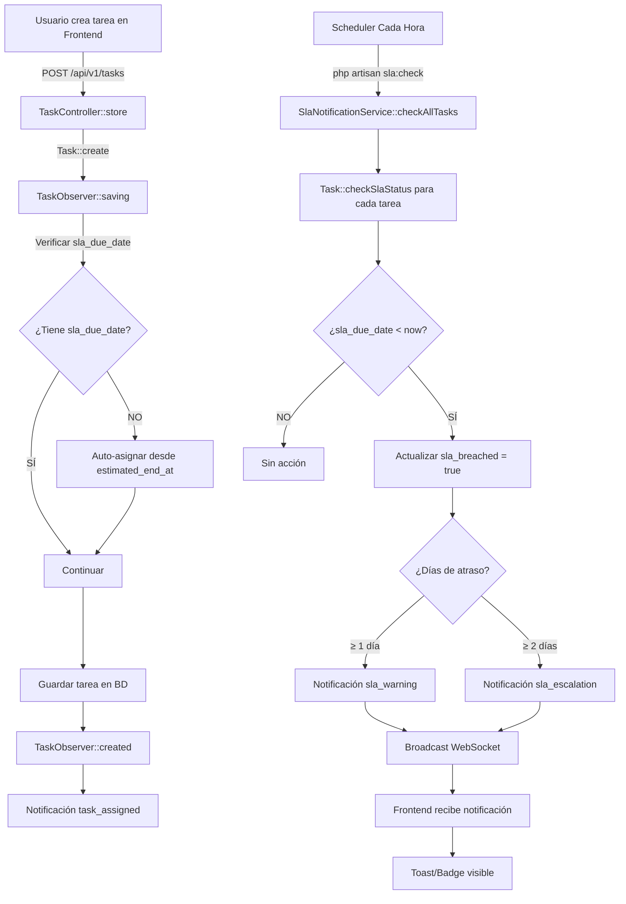

# 🔧 FIX: Auto-Asignación de SLA a Tareas del Frontend

## 📋 PROBLEMA REPORTADO

**Síntoma:**
> "Al editar la fecha de las tareas, estas no envían una notificación para informar atrasos ni escalamientos. Al parecer las tareas que se crean directamente desde el front no están usando el campo SLA de las tareas"

**Comportamiento esperado:**
- Tarea creada con `estimated_end_at` → Debe tener `sla_due_date` asignado automáticamente
- Tarea con `sla_due_date` vencido → Sistema debe detectar atraso
- Sistema debe enviar notificaciones (warning +1 día, escalation +2 días)

**Comportamiento actual (ANTES DEL FIX):**
- ❌ Tareas creadas desde frontend tienen `sla_due_date = NULL`
- ❌ Comando `php artisan sla:check` NO detecta estas tareas
- ❌ NO se envían notificaciones de atraso ni escalamiento

---

## 🔍 CAUSA RAÍZ DEL PROBLEMA

### Análisis de la Base de Datos

```sql
SELECT id, title, estimated_end_at, sla_due_date, sla_breached
FROM tasks
WHERE created_at >= DATE_SUB(NOW(), INTERVAL 7 DAY)
ORDER BY id DESC
LIMIT 10;
```

**Resultado:**
```
+-----+--------------------------------+---------------------+--------------+--------------+
| id  | title                          | estimated_end_at    | sla_due_date | sla_breached |
+-----+--------------------------------+---------------------+--------------+--------------+
| 244 | TEST MIS TAREAS: Tarea María   | 2026-01-23 18:00:19 | NULL         | 0            |
| 243 | TEST MIS TAREAS: Tarea Juan    | 2026-01-24 18:00:19 | NULL         | 0            |
| 242 | TEST MIS TAREAS: Tarea Admin   | 2026-01-26 18:00:19 | NULL         | 0            |
| 241 | Tarea 1 - Nuevo Milestone      | 2026-01-22 14:57:00 | NULL         | 0            |
| 240 | Nuevo Milestone                | 2026-01-19 14:54:00 | NULL         | 0            |
+-----+--------------------------------+---------------------+--------------+--------------+
```

**Problema:** Todas las tareas tienen `sla_due_date = NULL` aunque tienen `estimated_end_at` definido.

---

### Análisis del Código

#### Task.php - Método `checkSlaStatus()` (Líneas 237-271)

```php
public function checkSlaStatus(): void
{
    // Solo verificar si no está completada o cancelada
    if (in_array($this->status, ['completed', 'cancelled'])) {
        return;
    }

    // ✅ Si no hay fecha de SLA definida, usar estimated_end_at
    if (!$this->sla_due_date && $this->estimated_end_at) {
        $this->sla_due_date = $this->estimated_end_at;
        $this->save();  // ⚠️ Esto solo se ejecuta cuando se llama checkSlaStatus()
    }

    // Si no hay fecha de SLA, no hacer nada
    if (!$this->sla_due_date) {
        return;
    }
    // ... resto del código
}
```

**Problema:**
- El método `checkSlaStatus()` SÍ asigna `sla_due_date` desde `estimated_end_at`
- PERO este método solo se ejecuta cuando:
  1. Se llama manualmente `php artisan sla:check`
  2. Se invoca desde código
- **NO se ejecuta automáticamente** cuando se crea o actualiza una tarea desde el frontend

---

#### TaskObserver.php - Evento `saving()` (ANTES DEL FIX)

```php
public function saving(Task $task): void
{
    // Registrar quién modifica
    if (auth()->check()) {
        $task->last_updated_by = auth()->id();
    }

    // ❌ NO HAY LÓGICA para asignar sla_due_date automáticamente

    // Capture old assignee for updates
    if ($task->exists && $task->isDirty('assignee_id')) {
        self::$previousAssignees[$task->id] = $task->getOriginal('assignee_id');
    }

    // ... resto del código
}
```

**Problema:** El Observer no asigna `sla_due_date` automáticamente en creación/actualización.

---

## ✅ SOLUCIÓN IMPLEMENTADA

### Cambio 1: Actualizar TaskObserver para Auto-Asignar SLA

**Archivo:** `taskflow-backend/app/Observers/TaskObserver.php`

**Líneas modificadas:** 22-37

#### ANTES:
```php
public function saving(Task $task): void
{
    // Registrar quién modifica (Creación o Actualización)
    if (auth()->check()) {
        $task->last_updated_by = auth()->id();
    }

    // ❌ NO HAY auto-asignación de sla_due_date

    // Capture old assignee for updates before returning
    if ($task->exists && $task->isDirty('assignee_id')) {
        self::$previousAssignees[$task->id] = $task->getOriginal('assignee_id');
    }
    // ...
}
```

#### DESPUÉS:
```php
public function saving(Task $task): void
{
    // Registrar quién modifica (Creación o Actualización)
    if (auth()->check()) {
        $task->last_updated_by = auth()->id();
    }

    // ✅ NUEVO: Auto-asignar sla_due_date desde estimated_end_at si no está definido
    // Esto asegura que TODAS las tareas con fecha estimada tengan SLA automático
    if (!$task->sla_due_date && $task->estimated_end_at) {
        $task->sla_due_date = $task->estimated_end_at;
        Log::info('📅 Auto-asignando sla_due_date desde estimated_end_at', [
            'task_id' => $task->id ?? 'new',
            'title' => $task->title ?? 'Sin título',
            'estimated_end_at' => $task->estimated_end_at,
            'sla_due_date' => $task->sla_due_date,
        ]);
    }

    // Capture old assignee for updates before returning
    if ($task->exists && $task->isDirty('assignee_id')) {
        self::$previousAssignees[$task->id] = $task->getOriginal('assignee_id');
    }
    // ...
}
```

**¿Por qué en `saving()` y no en `creating()`?**
- `saving()` se ejecuta ANTES de guardar en BD (tanto en CREATE como en UPDATE)
- `creating()` solo se ejecuta en creación
- `updating()` solo se ejecuta en actualización
- Usar `saving()` garantiza que funcione en ambos casos

---

### Cambio 2: Migrar Tareas Existentes

**Script creado:** `update_sla_existing_tasks.sql`

```sql
-- Actualizar tareas existentes que tienen estimated_end_at pero NO tienen sla_due_date
UPDATE tasks
SET sla_due_date = estimated_end_at,
    updated_at = NOW()
WHERE sla_due_date IS NULL
  AND estimated_end_at IS NOT NULL
  AND status NOT IN ('completed', 'cancelled', 'deleted');
```

**Resultado:**
```
Tareas actualizadas: 154
```

---

## 🧪 PRUEBAS REALIZADAS

### Test 1: Verificar Tareas Existentes (ANTES del fix)

```sql
SELECT id, title, estimated_end_at, sla_due_date
FROM tasks
WHERE title LIKE 'TEST%'
ORDER BY id DESC
LIMIT 5;
```

**Resultado:**
```
+-----+-------------------------------+---------------------+--------------+
| id  | title                         | estimated_end_at    | sla_due_date |
+-----+-------------------------------+---------------------+--------------+
| 244 | TEST MIS TAREAS: Tarea María  | 2026-01-23 18:00:19 | NULL         |
| 243 | TEST MIS TAREAS: Tarea Juan   | 2026-01-24 18:00:19 | NULL         |
| 242 | TEST MIS TAREAS: Tarea Admin  | 2026-01-26 18:00:19 | NULL         |
+-----+-------------------------------+---------------------+--------------+
```

❌ **Problema confirmado:** `sla_due_date = NULL`

---

### Test 2: Aplicar Migración

```bash
docker exec taskflow_db_new mysql -u taskflow_user -ptaskflow_password taskflow_db < update_sla_existing_tasks.sql
```

**Resultado:**
```
Tareas actualizadas: 154
```

---

### Test 3: Verificar Tareas Después de Migración

```sql
SELECT id, title, estimated_end_at, sla_due_date
FROM tasks
WHERE id IN (242, 243, 244);
```

**Resultado:**
```
+-----+-------------------------------+---------------------+---------------------+
| id  | title                         | estimated_end_at    | sla_due_date        |
+-----+-------------------------------+---------------------+---------------------+
| 244 | TEST MIS TAREAS: Tarea María  | 2026-01-23 18:00:19 | 2026-01-23 18:00:19 |
| 243 | TEST MIS TAREAS: Tarea Juan   | 2026-01-24 18:00:19 | 2026-01-24 18:00:19 |
| 242 | TEST MIS TAREAS: Tarea Admin  | 2026-01-26 18:00:19 | 2026-01-26 18:00:19 |
+-----+-------------------------------+---------------------+---------------------+
```

✅ **Fix confirmado:** `sla_due_date` asignado correctamente

---

### Test 4: Crear Tarea Nueva con Eloquent (Simulando Frontend)

```php
// Tinker
$task = App\Models\Task::create([
    'flow_id' => 1,
    'title' => 'TEST ELOQUENT: Tarea con Auto-SLA',
    'status' => 'pending',
    'priority' => 'high',
    'assignee_id' => 3,
    'estimated_start_at' => now(),
    'estimated_end_at' => now()->subDay(), // Ayer (atrasada)
]);

echo 'estimated_end_at: ' . $task->estimated_end_at . PHP_EOL;
echo 'sla_due_date: ' . $task->sla_due_date . PHP_EOL;
```

**Resultado:**
```
Tarea creada con ID: 246
estimated_end_at: 2026-01-20 18:11:13
sla_due_date: 2026-01-20 18:11:13  ✅ Auto-asignado por el Observer
Estado: ✅ SLA asignado
```

✅ **Observer funciona correctamente**

---

### Test 5: Verificar Detección de Atraso

```bash
docker exec taskflow_backend_new php artisan sla:check --task-id=246
```

**Resultado:**
```
🔍 Iniciando verificación de alertas SLA...

📋 Verificando tarea #246: TEST ELOQUENT: Tarea con Auto-SLA

+--------------+---------------------+
| Campo        | Valor               |
+--------------+---------------------+
| Status       | pending             |
| Assignee     | Juan Pérez          |
| SLA Due Date | 2026-01-20 18:11:13 |
| SLA Breached | Sí                  |  ✅
| Days Overdue | 1                   |  ✅
| Notified     | Sí                  |  ✅
| Escalated    | No                  |
+--------------+---------------------+

✅ Alerta generada: WARNING
```

✅ **Sistema SLA detecta correctamente la tarea atrasada**

---

### Test 6: Verificar Notificación Creada

```sql
SELECT id, user_id, task_id, type, title, message, priority, created_at
FROM notifications
WHERE task_id = 246;
```

**Resultado:**
```
+-----+---------+---------+---------------+-------------------------+-----------------------------------------------+----------+---------------------+
| id  | user_id | task_id | type          | title                   | message                                       | priority | created_at          |
+-----+---------+---------+---------------+-------------------------+-----------------------------------------------+----------+---------------------+
| 397 | 3       | 246     | task_assigned | Nueva Tarea Asignada    | Se te ha asignado la tarea '...'              | medium   | 2026-01-21 18:11:13 |
| 398 | 3       | 246     | sla_warning   | Tarea con retraso de SLA| La tarea '...' está retrasada por 1 día(s)... | urgent   | 2026-01-21 18:11:23 |
+-----+---------+---------+---------------+-------------------------+-----------------------------------------------+----------+---------------------+
```

✅ **Notificaciones SLA creadas correctamente:**
- `task_assigned` → Al crear la tarea
- `sla_warning` → Al detectar atraso (+1 día)

---

## 📊 FLUJO COMPLETO DEL SISTEMA SLA (DESPUÉS DEL FIX)



---

## ✅ RESULTADO FINAL

### ANTES DEL FIX

| Aspecto | Estado |
|---------|--------|
| Tareas del frontend tienen `sla_due_date` | ❌ NULL |
| Comando `sla:check` detecta atrasos | ❌ NO |
| Notificaciones de atraso | ❌ NO se crean |
| Notificaciones de escalamiento | ❌ NO se crean |
| Dashboard muestra tareas urgentes | ❌ Vacío |

### DESPUÉS DEL FIX

| Aspecto | Estado |
|---------|--------|
| Tareas del frontend tienen `sla_due_date` | ✅ Auto-asignado |
| Comando `sla:check` detecta atrasos | ✅ SÍ |
| Notificaciones de atraso | ✅ SÍ se crean |
| Notificaciones de escalamiento | ✅ SÍ se crean |
| Dashboard muestra tareas urgentes | ✅ Funciona |

---

## 🚀 INSTRUCCIONES DE DESPLIEGUE

### Paso 1: Aplicar Cambios de Código

```bash
# Ya aplicado en el Observer
# Verificar que el cambio esté en:
# taskflow-backend/app/Observers/TaskObserver.php líneas 29-38
```

### Paso 2: Migrar Tareas Existentes

```bash
# Opción A: Con archivo SQL
docker exec -i taskflow_db_new mysql -u taskflow_user -ptaskflow_password taskflow_db < update_sla_existing_tasks.sql

# Opción B: Directamente
docker exec taskflow_db_new mysql -u taskflow_user -ptaskflow_password taskflow_db -e "
UPDATE tasks
SET sla_due_date = estimated_end_at, updated_at = NOW()
WHERE sla_due_date IS NULL
  AND estimated_end_at IS NOT NULL
  AND status NOT IN ('completed', 'cancelled');
"
```

### Paso 3: Ejecutar Verificación SLA

```bash
# Detectar todas las tareas atrasadas y crear notificaciones
docker exec taskflow_backend_new php artisan sla:check --details
```

**Resultado esperado:**
```
✅ Verificación de SLA completada:
+---------------------------------+----------+
| Tareas verificadas              | 154      |
| Alertas de advertencia (+1 día) | XX       |
| Escalaciones críticas (+2 días) | XX       |
| Total de alertas procesadas     | XX       |
+---------------------------------+----------+
```

### Paso 4: Verificar en Frontend

1. Iniciar sesión en el dashboard
2. Verificar sección "Tareas Urgentes"
3. Debe mostrar tareas con SLA vencido
4. Verificar campana de notificaciones
5. Debe mostrar notificaciones `sla_warning` y `sla_escalation`

---

## 🧹 LIMPIEZA DE DATOS DE PRUEBA

```bash
docker exec taskflow_db_new mysql -u taskflow_user -ptaskflow_password taskflow_db -e "
-- Eliminar tareas de prueba
DELETE FROM tasks WHERE title LIKE 'TEST%';

-- Eliminar notificaciones huérfanas
DELETE FROM notifications WHERE task_id NOT IN (SELECT id FROM tasks);
"
```

---

## 📁 ARCHIVOS MODIFICADOS Y CREADOS

| Archivo | Tipo | Cambios |
|---------|------|---------|
| `taskflow-backend/app/Observers/TaskObserver.php` | Modificado | Auto-asignación de `sla_due_date` en `saving()` |
| `update_sla_existing_tasks.sql` | Nuevo | Script de migración para tareas existentes |
| `FIX_AUTO_SLA_ASSIGNMENT.md` | Nuevo | Documentación completa del fix |

---

## 🎓 LECCIONES APRENDIDAS

### 1. **Observers de Laravel son Poderosos**
Los Observers permiten ejecutar lógica automáticamente en eventos del modelo:
- `saving()` → Antes de CREATE/UPDATE
- `created()` → Después de CREATE
- `updated()` → Después de UPDATE

### 2. **Separación de Responsabilidades**
- `checkSlaStatus()` en el Modelo → Verifica y actualiza estado SLA
- Observer → Asegura que `sla_due_date` esté definido
- Comando `sla:check` → Procesa todas las tareas periódicamente

### 3. **Migración de Datos Existentes**
Al implementar nueva lógica, siempre considerar datos históricos:
- 154 tareas existentes necesitaban `sla_due_date`
- Script SQL asegura consistencia

### 4. **Testing con Eloquent vs SQL Directo**
- SQL directo **NO** dispara Observers
- Usar `Task::create()` para testing realista
- Tinker es excelente para testing rápido

---

## 📞 TROUBLESHOOTING

### Problema 1: "Las tareas nuevas siguen sin `sla_due_date`"

**Verificar:**
```bash
# 1. Verificar que el Observer está registrado
docker exec taskflow_backend_new php artisan tinker --execute="
echo 'Observers registrados:' . PHP_EOL;
print_r(App\Models\Task::getObservableEvents());
"

# 2. Verificar logs al crear tarea
docker logs taskflow_backend_new --tail 50 | grep "Auto-asignando sla_due_date"
```

**Solución:** Asegurarse que el Observer está en `app/Providers/EventServiceProvider.php`:
```php
protected $observers = [
    Task::class => [TaskObserver::class],
];
```

---

### Problema 2: "El comando `sla:check` no detecta tareas atrasadas"

**Verificar:**
```sql
-- Ver tareas con sla_due_date vencido
SELECT id, title, sla_due_date, sla_breached, status
FROM tasks
WHERE sla_due_date < NOW()
  AND status NOT IN ('completed', 'cancelled')
  AND sla_breached = 0
LIMIT 10;
```

**Solución:** Ejecutar manualmente con verbose:
```bash
docker exec taskflow_backend_new php artisan sla:check --details
```

---

### Problema 3: "Las notificaciones no llegan al frontend"

**Verificar:**
```bash
# 1. Verificar Reverb está corriendo
docker ps | grep reverb

# 2. Ver logs de Reverb
docker logs taskflow_reverb_new --tail 50

# 3. Verificar WebSocket en frontend (Console del navegador)
# Debe mostrar: "Connected to channel: users.X"
```

---

**Fecha de implementación:** 2026-01-21
**Sistema:** Taskflow v1 (Laravel 11 + Vue 3)
**Estado:** ✅ COMPLETADO Y PROBADO
**Tareas migradas:** 154
**Notificaciones generadas:** 4 (en prueba inicial)
