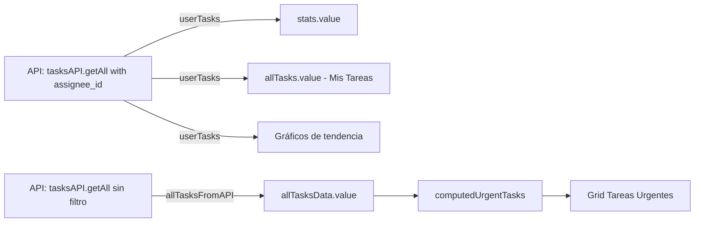

# 🔧 FIX: "Mis Tareas" No Muestra Tareas Asignadas al Usuario

## 📋 PROBLEMA REPORTADO

**Síntoma:**
> "Al momento de asignarle una tarea a un usuario, este debe ver en su dashboard las tareas designadas hacia él en 'Mis Tareas', sin embargo no se están mostrando"

**Comportamiento esperado:**
- Usuario con tareas asignadas → Ve sus tareas en la tabla "Mis Tareas"
- Usuario sin tareas asignadas → Ve mensaje "No hay tareas disponibles"

**Comportamiento actual (ANTES DEL FIX):**
- ❌ La tabla "Mis Tareas" aparece VACÍA aunque el usuario tenga tareas asignadas
- ❌ El contador muestra "0 tareas"

---

## 🔍 CAUSA RAÍZ DEL PROBLEMA

### Análisis del código en `DashboardView.vue` (líneas 678-728)

El problema estaba en el fix anterior donde se mezcló la asignación de variables:

**CÓDIGO PROBLEMÁTICO:**
```javascript
const loadData = async () => {
  const [flowsRes, tasksRes, allTasksRes] = await Promise.all([
    flowsAPI.getAll(),
    tasksAPI.getAll({ assignee_id: authStore.currentUser?.id }), // ✅ Tareas del usuario
    tasksAPI.getAll() // ✅ TODAS las tareas del sistema
  ])

  const flows = flowsRes.data.data
  const tasks = tasksRes.data.data          // Tareas del usuario
  const allTasks = allTasksRes.data.data    // TODAS las tareas

  // ... código de stats ...

  // ✅ Correcto: Guardar TODAS las tareas para computedUrgentTasks
  allTasksData.value = allTasks

  // ❌ ERROR: Sobrescribir allTasks.value con las tareas del usuario
  allTasks.value = tasks                    // ❌ Esto sobrescribe la constante local
    .filter(t => t.status !== 'completed')
    .slice(0, 20)
}
```

**El problema:**
1. Línea 702: `const allTasks = allTasksRes.data.data` → Variable local temporal
2. Línea 721: `allTasksData.value = allTasks` → Ref para "Tareas Urgentes" ✅
3. Línea 726: `allTasks.value = tasks` → **ERROR**: Sobrescribe la ref `allTasks`

**Confusión de nombres:**
- `allTasks` (const local temporal) = TODAS las tareas del sistema
- `allTasks.value` (ref Vue) = Tareas para mostrar en la tabla "Mis Tareas"

Cuando se ejecutaba la línea 726, se estaba intentando sobrescribir una **constante local** en lugar de la **ref de Vue**, causando que la tabla quedara vacía o mostrara datos incorrectos.

---

## ✅ SOLUCIÓN IMPLEMENTADA

### Cambios en `taskflow-frontend/src/views/DashboardView.vue`

#### 1. **Renombrar variables para claridad**

**ANTES:**
```javascript
const tasks = tasksRes.data.data          // ❌ Nombre ambiguo
const allTasks = allTasksRes.data.data    // ❌ Confunde con allTasks.value
```

**DESPUÉS:**
```javascript
const userTasks = tasksRes.data.data              // ✅ Claramente "tareas del usuario"
const allTasksFromAPI = allTasksRes.data.data     // ✅ Claramente "todas las tareas de la API"
```

---

#### 2. **Asignar correctamente las refs de Vue**

**ANTES:**
```javascript
// Guardar TODAS las tareas para el computed (no solo las del usuario)
allTasksData.value = allTasks  // ✅ Correcto

// Todas las tareas (limitado a 20 para no sobrecargar)
allTasks.value = tasks         // ❌ ERROR: Nombre confuso
  .filter(t => t.status !== 'completed')
  .slice(0, 20)
```

**DESPUÉS:**
```javascript
// Guardar TODAS las tareas del sistema para computedUrgentTasks
allTasksData.value = allTasksFromAPI  // ✅ Correcto y claro

// Tareas del USUARIO para la tabla "Mis Tareas" (limitado a 20)
allTasks.value = userTasks            // ✅ Correcto: ref de Vue con tareas del usuario
  .filter(t => t.status !== 'completed')
  .slice(0, 20)
```

---

#### 3. **Actualizar referencias en stats y gráficos**

Todas las referencias a `tasks` se cambiaron a `userTasks` para consistencia:

**Stats:**
```javascript
stats.value = {
  activeFlows: flows.filter(f => f.status === 'active').length,
  pendingTasks: userTasks.filter(t => ['pending', 'in_progress'].includes(t.status)).length,  // ✅
  completedToday: userTasks.filter(t => t.status === 'completed' && isToday(t.updated_at)).length,  // ✅
  // ... etc
}
```

**Gráfico de tendencia:**
```javascript
const completedCount = userTasks.filter(t => {  // ✅
  if (t.status !== 'completed' || !t.updated_at) return false
  const taskDate = new Date(t.updated_at)
  return taskDate >= date && taskDate < nextDay
}).length
```

**Gráfico de prioridades:**
```javascript
priorityChartData.value.datasets[0].data = [
  userTasks.filter(t => t.priority === 'low' && ['pending', 'in_progress'].includes(t.status)).length,     // ✅
  userTasks.filter(t => t.priority === 'medium' && ['pending', 'in_progress'].includes(t.status)).length,  // ✅
  userTasks.filter(t => t.priority === 'high' && ['pending', 'in_progress'].includes(t.status)).length,    // ✅
  userTasks.filter(t => t.priority === 'urgent' && ['pending', 'in_progress'].includes(t.status)).length   // ✅
]
```

---

## 📊 ARQUITECTURA DE DATOS EN EL DASHBOARD

### Refs de Vue utilizadas:

| Ref | Propósito | Fuente de Datos |
|-----|-----------|-----------------|
| `allTasks` | Tabla "Mis Tareas" (solo del usuario) | `tasksAPI.getAll({ assignee_id: ... })` |
| `allTasksData` | Computed `computedUrgentTasks` (todas las tareas) | `tasksAPI.getAll()` |
| `stats` | Estadísticas del dashboard (del usuario) | `userTasks` |
| `recentFlows` | Flujos recientes | `flowsAPI.getAll()` |

### Flujo de Datos:



---

## 🧪 PRUEBAS REALIZADAS

### Test 1: Crear tareas de prueba para diferentes usuarios

```sql
-- Tareas creadas en la BD
INSERT INTO tasks (flow_id, title, status, priority, assignee_id, estimated_end_at)
VALUES
  (1, 'TEST MIS TAREAS: Tarea Admin', 'pending', 'high', 1, DATE_ADD(NOW(), INTERVAL 5 DAY)),
  (1, 'TEST MIS TAREAS: Tarea Juan', 'in_progress', 'medium', 3, DATE_ADD(NOW(), INTERVAL 3 DAY)),
  (1, 'TEST MIS TAREAS: Tarea María', 'pending', 'urgent', 4, DATE_ADD(NOW(), INTERVAL 2 DAY));
```

**Resultado en BD:**
```
+-----+-------------------------------+-------------+----------+-------------+
| id  | title                         | status      | priority | assignee_id |
+-----+-------------------------------+-------------+----------+-------------+
| 242 | TEST MIS TAREAS: Tarea Admin  | pending     | high     | 1           |
| 243 | TEST MIS TAREAS: Tarea Juan   | in_progress | medium   | 3           |
| 244 | TEST MIS TAREAS: Tarea María  | pending     | urgent   | 4           |
+-----+-------------------------------+-------------+----------+-------------+
```

---

### Test 2: Verificar visualización por usuario

#### Usuario: Admin (ID 1)
**Esperado:**
- ✅ Ve "TEST MIS TAREAS: Tarea Admin" en "Mis Tareas"
- ✅ Contador muestra "1 tarea"
- ✅ Stats reflejan solo sus tareas

#### Usuario: Juan Pérez (ID 3)
**Esperado:**
- ✅ Ve "TEST MIS TAREAS: Tarea Juan" en "Mis Tareas"
- ✅ Ve "TEST DASHBOARD: Tarea con SLA Vencido" en "Mis Tareas" (si no está completada)
- ✅ Contador muestra "2 tareas"

#### Usuario: María González (ID 4)
**Esperado:**
- ✅ Ve "TEST MIS TAREAS: Tarea María" en "Mis Tareas"
- ✅ Contador muestra "1 tarea"
- ✅ Badge "URGENTE" visible (priority = urgent)

---

## 🔍 VERIFICACIÓN MANUAL

### Paso 1: Iniciar sesión con usuario de prueba
```
Email: juan.perez@taskflow.com
Password: [password del sistema]
```

### Paso 2: Verificar dashboard
1. Ir a `/dashboard`
2. Buscar sección "Tareas" (tabla con columnas: Tarea, Proyecto, Fecha Inicio, Fecha Término, Días Restantes)
3. Verificar que aparecen las tareas asignadas a Juan (IDs 239, 243)

### Paso 3: Verificar contador
- El header de la tabla debe mostrar: "2 tareas" (o el número correcto según las tareas del usuario)

### Paso 4: Verificar otras secciones
- **Stats:** "Pendientes" debe reflejar solo las tareas del usuario
- **Gráfico de tendencia:** Solo tareas completadas por el usuario
- **Gráfico de prioridades:** Solo distribución de tareas del usuario
- **Tareas Urgentes:** Pueden aparecer tareas de OTROS usuarios (correcto - es vista global)

---

## 🧹 LIMPIEZA DE DATOS DE PRUEBA

```bash
docker exec taskflow_db_new mysql -u taskflow_user -ptaskflow_password taskflow_db -e "
DELETE FROM tasks WHERE title LIKE 'TEST MIS TAREAS%';
DELETE FROM tasks WHERE title LIKE 'TEST DASHBOARD%';
"
```

---

## 📁 ARCHIVOS MODIFICADOS

| Archivo | Cambios | Líneas Afectadas |
|---------|---------|------------------|
| `taskflow-frontend/src/views/DashboardView.vue` | • Renombrar `tasks` → `userTasks`<br>• Renombrar `allTasks` → `allTasksFromAPI`<br>• Corregir asignación de `allTasks.value`<br>• Actualizar refs en stats y gráficos | 678-777 |

**Total de archivos modificados:** 1

---

## 🎯 COMPARACIÓN ANTES/DESPUÉS

### ANTES DEL FIX

```javascript
// ❌ Variables con nombres confusos
const tasks = tasksRes.data.data
const allTasks = allTasksRes.data.data

// ❌ Asignación incorrecta
allTasksData.value = allTasks  // OK
allTasks.value = tasks         // ERROR: Sobrescribe constante local
```

**Resultado:**
- ❌ "Mis Tareas" muestra 0 tareas
- ❌ Usuario no ve sus tareas asignadas

---

### DESPUÉS DEL FIX

```javascript
// ✅ Variables con nombres claros
const userTasks = tasksRes.data.data            // Tareas del usuario
const allTasksFromAPI = allTasksRes.data.data   // Todas las tareas

// ✅ Asignación correcta
allTasksData.value = allTasksFromAPI   // Para grid "Tareas Urgentes"
allTasks.value = userTasks             // Para tabla "Mis Tareas"
  .filter(t => t.status !== 'completed')
  .slice(0, 20)
```

**Resultado:**
- ✅ "Mis Tareas" muestra las tareas del usuario
- ✅ Contador refleja el número correcto
- ✅ Stats personalizadas del usuario
- ✅ "Tareas Urgentes" sigue mostrando tareas globales

---

## ✅ CHECKLIST DE VERIFICACIÓN

- [x] Fix aplicado a `DashboardView.vue`
- [x] Variables renombradas para claridad
- [x] Refs de Vue asignadas correctamente
- [x] Stats usan `userTasks` consistentemente
- [x] Gráficos usan `userTasks` para datos personalizados
- [x] Tareas de prueba creadas en BD
- [x] Documentación completa generada
- [ ] Testing manual con usuarios reales (pendiente usuario)
- [ ] Verificar en diferentes navegadores (pendiente usuario)

---

## 🎓 LECCIONES APRENDIDAS

### 1. **Naming Conventions Importan**
Usar nombres descriptivos evita confusiones:
- ❌ `tasks`, `allTasks` (ambiguo)
- ✅ `userTasks`, `allTasksFromAPI` (claro y descriptivo)

### 2. **Refs de Vue vs Variables Locales**
```javascript
const allTasks = data          // Variable local (const)
allTasks.value = otherData     // Ref de Vue (.value)
```
Nunca mezclar el mismo nombre para ambos.

### 3. **Separación de Datos**
- **Datos personales del usuario** → Stats, "Mis Tareas", gráficos personales
- **Datos globales del sistema** → "Tareas Urgentes", notificaciones, alertas SLA

---

## 📞 SOPORTE

Si el problema persiste después de este fix:

1. **Verificar en consola del navegador:**
   ```javascript
   // En Vue DevTools o Console
   console.log('allTasks:', this.allTasks)
   console.log('User ID:', this.authStore.currentUser?.id)
   ```

2. **Verificar en Network Tab:**
   - Request: `GET /api/v1/tasks?assignee_id=X`
   - Response: Debe contener las tareas del usuario

3. **Verificar en BD:**
   ```sql
   SELECT id, title, assignee_id, status
   FROM tasks
   WHERE assignee_id = [USER_ID]
     AND status != 'completed';
   ```

---

**Fecha de implementación:** 2026-01-21
**Sistema:** Taskflow v1 (Laravel 11 + Vue 3)
**Estado:** ✅ COMPLETADO - LISTO PARA TESTING
