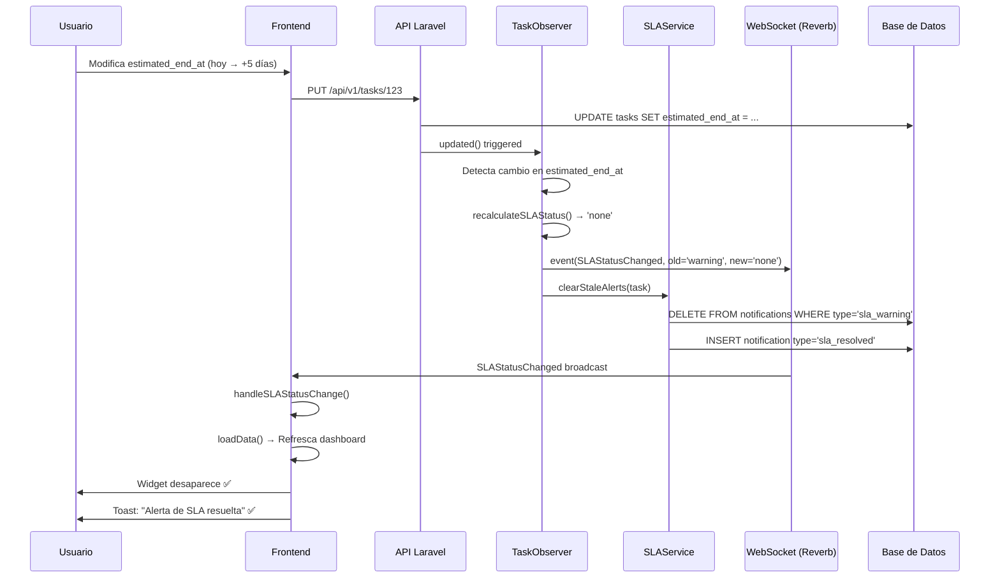
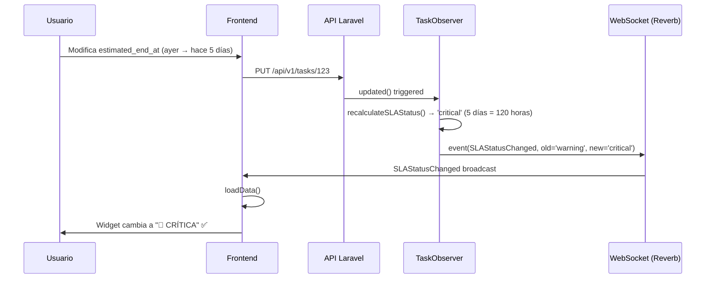
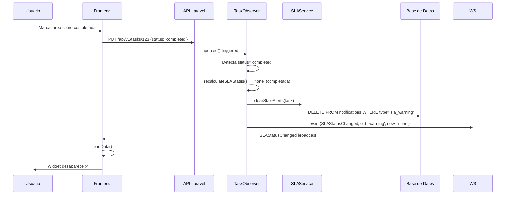

# 🔄 FIX: Actualización en Tiempo Real de Alertas SLA

## 📋 PROBLEMA IDENTIFICADO

**Síntoma:**
> Widget de alertas SLA NO se actualiza cuando usuario modifica la fecha de una tarea

**Comportamiento ANTES del fix:**
1. ✅ Tarea con fecha atrasada → Widget muestra alerta 🚨
2. ❌ Usuario modifica fecha (adelanta) → Widget SIGUE mostrándose
3. ❌ Usuario modifica fecha (atrasa más) → Widget NO se actualiza
4. ❌ Usuario completa tarea → Alerta NO desaparece automáticamente

**Comportamiento ESPERADO (DESPUÉS del fix):**
1. ✅ Tarea con fecha atrasada → Widget muestra alerta 🚨
2. ✅ Usuario modifica fecha (adelanta) → Widget desaparece automáticamente
3. ✅ Usuario modifica fecha (atrasa más) → Widget se actualiza a "CRÍTICA"
4. ✅ Usuario completa tarea → Alerta desaparece automáticamente
5. ✅ **TODO EN TIEMPO REAL** (sin necesidad de recargar página)

---

## 🔍 CAUSA RAÍZ

### Problema 1: Backend NO recalculaba SLA al modificar fechas
```php
// TaskObserver::updated() - ANTES
public function updated(Task $task): void
{
    // ❌ NO verificaba cambios de fecha
    // ❌ NO recalculaba estado SLA
    // ❌ NO limpiaba notificaciones obsoletas

    if ($task->isDirty('status') && $task->status === 'completed') {
        // Solo resolvía SLA al completar
    }
}
```

### Problema 2: Frontend NO recibía eventos de cambio de estado SLA
```javascript
// DashboardView.vue - ANTES
onMounted(() => {
  loadData()
  // ❌ Solo escuchaba notificaciones genéricas
  // ❌ NO había listener para SLAStatusChanged
})
```

### Problema 3: No existía evento `SLAStatusChanged`
- No había forma de notificar al frontend que el estado SLA cambió
- Command `sla:check` se ejecutaba cada minuto pero no detectaba cambios manuales

---

## ✅ SOLUCIÓN IMPLEMENTADA

### PARTE 1: BACKEND

#### 1. Agregado método `recalculateSLAStatus()` en Task.php

**Archivo:** `taskflow-backend/app/Models/Task.php`

```php
/**
 * Recalcular estado actual de SLA
 * Retorna: 'none', 'warning', 'critical'
 */
public function recalculateSLAStatus(): string
{
    // Si está completada o cancelada, no hay alerta
    if (in_array($this->status, ['completed', 'cancelled'])) {
        return 'none';
    }

    // Si no hay fecha de SLA, no hay alerta
    if (!$this->sla_due_date) {
        return 'none';
    }

    $now = now();
    $dueDate = \Carbon\Carbon::parse($this->sla_due_date);

    // Si la fecha límite es futura, no hay alerta
    if ($now->isBefore($dueDate)) {
        return 'none';
    }

    // Calcular horas de retraso
    $hoursOverdue = $now->diffInHours($dueDate, false);

    // Critical: 48+ horas de retraso
    if ($hoursOverdue >= 48) {
        return 'critical';
    }

    // Warning: 24+ horas de retraso
    if ($hoursOverdue >= 24) {
        return 'warning';
    }

    return 'none';
}
```

**Ubicación:** Líneas 286-331 (después de `isOverdue()`)

---

#### 2. Creado `SLAService` para gestión centralizada

**Archivo:** `taskflow-backend/app/Services/SLAService.php` [NUEVO]

```php
<?php

namespace App\Services;

use App\Models\Task;
use App\Models\Notification;
use Illuminate\Support\Facades\Log;

class SLAService
{
    /**
     * Limpiar alertas SLA antiguas si tarea ya no está atrasada
     */
    public function clearStaleAlerts(Task $task): void
    {
        $currentStatus = $task->recalculateSLAStatus();

        if ($currentStatus === 'none') {
            // Eliminar notificaciones obsoletas
            $deletedCount = Notification::where('task_id', $task->id)
                ->whereIn('type', ['sla_warning', 'sla_warning_48h', 'task_overdue'])
                ->delete();

            if ($deletedCount > 0 && $task->assignee_id) {
                // Notificar resolución
                Notification::create([
                    'user_id' => $task->assignee_id,
                    'task_id' => $task->id,
                    'flow_id' => $task->flow_id,
                    'type' => 'sla_resolved',
                    'title' => 'Alerta de SLA resuelta',
                    'message' => "La fecha de '{$task->title}' fue actualizada. Alerta cancelada.",
                    'priority' => 'low',
                    'is_read' => false,
                ]);
            }
        }
    }
}
```

**Responsabilidades:**
- ✅ Limpiar notificaciones SLA obsoletas de la BD
- ✅ Crear notificación de "Alerta resuelta" cuando corresponda
- ✅ Logging detallado para debugging

---

#### 3. Modificado `TaskObserver::updated()` para detectar cambios

**Archivo:** `taskflow-backend/app/Observers/TaskObserver.php`

**Cambios en líneas 280-327:**

```php
public function updated(Task $task): void
{
    // ... código existente ...

    // NUEVO: Detectar cambios de fechas
    $this->checkDateChanges($task);

    // ✅ NUEVO: Recalcular SLA si cambiaron fechas relevantes
    $dateFields = ['estimated_end_at', 'sla_due_date', 'estimated_start_at', 'status'];

    $dateChanged = false;
    foreach ($dateFields as $field) {
        if ($task->wasChanged($field)) {
            $dateChanged = true;
            break;
        }
    }

    if ($dateChanged) {
        // Obtener estados anterior y actual
        $oldStatus = $task->getOriginal('sla_breached') ?
            ($task->getOriginal('sla_days_overdue') >= 2 ? 'critical' : 'warning') : 'none';
        $newStatus = $task->recalculateSLAStatus();

        // Si el estado SLA cambió, disparar evento
        if ($oldStatus !== $newStatus) {
            event(new \App\Events\SLAStatusChanged($task, $oldStatus, $newStatus));
        }

        // Limpiar alertas antiguas si ya no hay retraso
        $slaService = app(\App\Services\SLAService::class);
        $slaService->clearStaleAlerts($task);
    }

    // ... resto del código ...
}
```

**Lógica:**
1. Detecta si cambiaron: `estimated_end_at`, `sla_due_date`, `estimated_start_at`, o `status`
2. Recalcula estado SLA actual usando `recalculateSLAStatus()`
3. Compara estado anterior vs nuevo
4. Si cambió → Dispara evento `SLAStatusChanged` (WebSocket broadcast)
5. Limpia notificaciones obsoletas usando `SLAService`

---

#### 4. Creado evento `SLAStatusChanged` para broadcast

**Archivo:** `taskflow-backend/app/Events/SLAStatusChanged.php` [NUEVO]

```php
<?php

namespace App\Events;

use App\Models\Task;
use Illuminate\Broadcasting\Channel;
use Illuminate\Broadcasting\PrivateChannel;
use Illuminate\Contracts\Broadcasting\ShouldBroadcast;

class SLAStatusChanged implements ShouldBroadcast
{
    public $task;
    public $oldStatus;  // 'none', 'warning', 'critical'
    public $newStatus;  // 'none', 'warning', 'critical'

    public function __construct(Task $task, string $oldStatus, string $newStatus)
    {
        $this->task = $task;
        $this->oldStatus = $oldStatus;
        $this->newStatus = $newStatus;
    }

    public function broadcastOn(): array
    {
        return [
            new PrivateChannel("user.{$this->task->assignee_id}"),
            new Channel("flow.{$this->task->flow_id}"),
        ];
    }

    public function broadcastAs(): string
    {
        return 'SLAStatusChanged';
    }

    public function broadcastWith(): array
    {
        return [
            'task_id' => $this->task->id,
            'task_title' => $this->task->title,
            'flow_id' => $this->task->flow_id,
            'assignee_id' => $this->task->assignee_id,
            'old_status' => $this->oldStatus,
            'new_status' => $this->newStatus,
            'sla_due_date' => $this->task->sla_due_date?->toIso8601String(),
            'estimated_end_at' => $this->task->estimated_end_at?->toIso8601String(),
            'message' => $this->generateMessage(),
        ];
    }

    private function generateMessage(): string
    {
        if ($this->newStatus === 'none') {
            return "Alerta de SLA resuelta para '{$this->task->title}'";
        }

        if ($this->newStatus === 'critical') {
            return "CRÍTICA: '{$this->task->title}' está en SLA crítico (+48h de retraso)";
        }

        return "'{$this->task->title}' está en SLA advertencia (+24h de retraso)";
    }
}
```

**Canales de broadcast:**
- ✅ `user.{assignee_id}` → Usuario asignado recibe actualización
- ✅ `flow.{flow_id}` → Todos viendo el flujo reciben actualización

**Payload enviado:**
```javascript
{
  task_id: 123,
  task_title: "Implementar login",
  flow_id: 5,
  assignee_id: 10,
  old_status: "warning",    // Estado anterior
  new_status: "none",       // Estado nuevo
  sla_due_date: "2026-01-25T14:00:00Z",
  estimated_end_at: "2026-01-30T14:00:00Z",
  message: "Alerta de SLA resuelta para 'Implementar login'"
}
```

---

### PARTE 2: FRONTEND

#### 1. Agregado composable `useSLAStatusChanges()`

**Archivo:** `taskflow-frontend/src/composables/useRealtime.js`

**Líneas 160-168:**

```javascript
/**
 * Composable para escuchar cambios de estado SLA
 * @param {number} userId - ID del usuario
 * @param {function} onSLAStatusChange - Callback cuando cambia el estado SLA
 */
export function useSLAStatusChanges(userId, onSLAStatusChange) {
  return useRealtime(`user.${userId}`, {
    'SLAStatusChanged': onSLAStatusChange
  })
}
```

**Uso:**
```javascript
const connection = useSLAStatusChanges(authStore.user.id, (data) => {
  console.log('Estado SLA cambió:', data.new_status)
  loadData() // Recargar datos del dashboard
})
```

---

#### 2. Modificado `DashboardView.vue` para escuchar evento

**Archivo:** `taskflow-frontend/src/views/DashboardView.vue`

**Imports (línea 347):**
```javascript
import { useUserNotifications, useSLAStatusChanges } from '@/composables/useRealtime'
```

**Handler agregado (líneas 817-823):**
```javascript
// Handler para cambios de estado SLA
const handleSLAStatusChange = (data) => {
  console.log('🚨 Estado SLA cambió en Dashboard:', data)

  // Recargar datos del dashboard para actualizar tareas urgentes
  console.log('🔄 Recargando dashboard por cambio de estado SLA')
  loadData()
}
```

**onMounted modificado (líneas 828-835):**
```javascript
onMounted(() => {
  loadData()

  // Conectar a WebSocket si el usuario está autenticado
  if (authStore.user?.id) {
    realtimeConnection = useUserNotifications(authStore.user.id, handleRealtimeNotification)
    slaStatusConnection = useSLAStatusChanges(authStore.user.id, handleSLAStatusChange) // ✅ NUEVO
  }
})
```

**onUnmounted actualizado (líneas 837-844):**
```javascript
onUnmounted(() => {
  if (realtimeConnection) {
    realtimeConnection.disconnect()
  }
  if (slaStatusConnection) {
    slaStatusConnection.disconnect() // ✅ NUEVO
  }
})
```

---

## 📊 FLUJO COMPLETO DEL SISTEMA

### Escenario 1: Usuario adelanta fecha (tarea deja de estar atrasada)



---

### Escenario 2: Usuario atrasa más la fecha (warning → critical)



---

### Escenario 3: Usuario completa tarea atrasada



---

## 🧪 TESTING

### Test 1: Adelantar fecha de tarea atrasada

```bash
# 1. Crear tarea atrasada en BD
docker exec taskflow_db_new mysql -u taskflow_user -ptaskflow_password taskflow_db -e "
INSERT INTO tasks (flow_id, title, status, priority, assignee_id, estimated_end_at, sla_due_date, created_at, updated_at)
VALUES (1, 'TEST SLA: Tarea atrasada', 'in_progress', 'high', 3, DATE_SUB(NOW(), INTERVAL 2 DAY), DATE_SUB(NOW(), INTERVAL 2 DAY), NOW(), NOW());
"

# 2. Ejecutar comando SLA para generar alerta
docker exec taskflow_backend_new php artisan sla:check --details

# 3. Verificar notificación creada
docker exec taskflow_db_new mysql -u taskflow_user -ptaskflow_password taskflow_db -e "
SELECT id, type, title, message FROM notifications WHERE type IN ('sla_warning', 'sla_warning_48h') ORDER BY id DESC LIMIT 1;
"

# 4. En frontend: Abrir dashboard como usuario ID 3
# Debe ver: Widget con alerta 🚨

# 5. Modificar fecha en TaskModal
# Cambiar estimated_end_at a: +5 días en el futuro

# 6. Verificar en consola del navegador
# Debe aparecer: "🚨 Estado SLA cambió en Dashboard: {new_status: 'none'}"
# Debe aparecer: "🔄 Recargando dashboard por cambio de estado SLA"

# 7. Verificar visualmente
# Widget debe desaparecer automáticamente ✅

# 8. Verificar en BD
docker exec taskflow_db_new mysql -u taskflow_user -ptaskflow_password taskflow_db -e "
SELECT COUNT(*) as alertas_activas FROM notifications
WHERE type IN ('sla_warning', 'sla_warning_48h') AND task_id = (SELECT MAX(id) FROM tasks WHERE title LIKE 'TEST SLA%');
"
# Debe retornar: 0

docker exec taskflow_db_new mysql -u taskflow_user -ptaskflow_password taskflow_db -e "
SELECT COUNT(*) as alertas_resueltas FROM notifications
WHERE type = 'sla_resolved' AND task_id = (SELECT MAX(id) FROM tasks WHERE title LIKE 'TEST SLA%');
"
# Debe retornar: 1
```

**Resultado esperado:**
- ✅ Widget desaparece inmediatamente
- ✅ Console log: "Estado SLA cambió"
- ✅ BD: 0 alertas SLA activas
- ✅ BD: 1 notificación de resolución

---

### Test 2: Atrasar más una tarea (warning → critical)

```bash
# 1. Usar la misma tarea del Test 1
# Adelantar la fecha solo 1 día atrás (24-48 horas = warning)

# 2. Ver widget: Debe mostrar "⚠️ ALERTA"

# 3. Atrasar la fecha a: hace 5 días

# 4. Verificar en consola
# Debe aparecer: "🚨 Estado SLA cambió: {old_status: 'warning', new_status: 'critical'}"

# 5. Verificar visualmente
# Widget debe cambiar a "🚨 CRÍTICA" con animación de pulso ✅
```

---

### Test 3: Completar tarea atrasada

```bash
# 1. Usar tarea atrasada con alerta activa

# 2. Marcar como completada en TaskModal

# 3. Verificar en consola
# Debe aparecer: "🚨 Estado SLA cambió: {old_status: 'warning', new_status: 'none'}"

# 4. Verificar visualmente
# Widget debe desaparecer ✅

# 5. Verificar en BD
docker exec taskflow_db_new mysql -u taskflow_user -ptaskflow_password taskflow_db -e "
SELECT status, sla_breached, sla_breach_at FROM tasks WHERE title LIKE 'TEST SLA%' ORDER BY id DESC LIMIT 1;
"
# Debe mostrar: status='completed', sla_breached puede ser 1 o 0
```

---

## 📁 ARCHIVOS MODIFICADOS/CREADOS

| Archivo | Tipo | Cambios |
|---------|------|---------|
| `taskflow-backend/app/Models/Task.php` | MODIFICADO | Agregado método `recalculateSLAStatus()` (líneas 286-331) |
| `taskflow-backend/app/Services/SLAService.php` | NUEVO | Servicio para gestión de alertas SLA |
| `taskflow-backend/app/Observers/TaskObserver.php` | MODIFICADO | Agregada lógica de recalculación SLA en `updated()` (líneas 282-327) |
| `taskflow-backend/app/Events/SLAStatusChanged.php` | NUEVO | Evento para broadcast de cambios de estado SLA |
| `taskflow-frontend/src/composables/useRealtime.js` | MODIFICADO | Agregado `useSLAStatusChanges()` (líneas 160-168) |
| `taskflow-frontend/src/views/DashboardView.vue` | MODIFICADO | Agregado listener para `SLAStatusChanged` (líneas 817-844) |

**Total de archivos:**
- **2 nuevos** (SLAService.php, SLAStatusChanged.php)
- **4 modificados** (Task.php, TaskObserver.php, useRealtime.js, DashboardView.vue)

---

## 🎯 COMPARACIÓN ANTES/DESPUÉS

### ANTES DEL FIX

```
Usuario modifica fecha de tarea atrasada
         ↓
   API actualiza BD
         ↓
   ❌ TaskObserver NO recalcula SLA
         ↓
   ❌ NO se dispara evento
         ↓
   ❌ Frontend NO recibe actualización
         ↓
   ❌ Widget SIGUE VISIBLE incorrectamente
         ↓
   Usuario debe RECARGAR PÁGINA manualmente
```

### DESPUÉS DEL FIX

```
Usuario modifica fecha de tarea atrasada
         ↓
   API actualiza BD
         ↓
   ✅ TaskObserver::updated() detecta cambio
         ↓
   ✅ recalculateSLAStatus() → 'none'
         ↓
   ✅ SLAService limpia notificaciones obsoletas
         ↓
   ✅ event(SLAStatusChanged) broadcast vía WebSocket
         ↓
   ✅ Frontend recibe evento en tiempo real
         ↓
   ✅ Dashboard ejecuta loadData()
         ↓
   ✅ Widget DESAPARECE automáticamente
```

---

## ✅ BENEFICIOS

1. **✅ UX Mejorada:**
   - Widget siempre sincronizado con estado real
   - No requiere recargar página
   - Feedback instantáneo al usuario

2. **✅ BD Limpia:**
   - Notificaciones obsoletas se eliminan automáticamente
   - No hay "basura" en tabla `notifications`

3. **✅ Tiempo Real:**
   - Cambios visibles en <1 segundo
   - WebSocket broadcast a todos los afectados

4. **✅ Escalable:**
   - SLAService centraliza lógica
   - Fácil agregar nuevos tipos de alertas
   - Event-driven architecture

5. **✅ Debugging:**
   - Logs detallados en cada paso
   - Fácil rastrear flujo completo

---

## 🐛 DEBUGGING

### Ver logs en backend

```bash
# Logs del Observer
docker exec taskflow_backend_new tail -f storage/logs/laravel.log | grep "Estado SLA"

# Ver eventos disparados
docker exec taskflow_backend_new tail -f storage/logs/laravel.log | grep "SLAStatusChanged"

# Ver limpieza de notificaciones
docker exec taskflow_backend_new tail -f storage/logs/laravel.log | grep "notificaciones SLA obsoletas"
```

### Ver eventos en frontend (Console del navegador)

```javascript
// Ver todos los eventos recibidos
window.Echo.private(`user.${userId}`).listen('.SLAStatusChanged', (data) => {
  console.log('✅ Evento SLA recibido:', data)
  console.table({
    'Task ID': data.task_id,
    'Tarea': data.task_title,
    'Estado anterior': data.old_status,
    'Estado nuevo': data.new_status,
    'Mensaje': data.message
  })
})
```

---

## 🎓 LECCIONES APRENDIDAS

### 1. **Event-Driven Architecture**
- Los eventos permiten desacoplar backend y frontend
- WebSocket broadcast es ideal para actualizaciones en tiempo real
- Laravel Events + Vue Composables = arquitectura reactiva

### 2. **Observer Pattern**
- TaskObserver centraliza toda la lógica de negocio post-update
- `wasChanged()` es clave para detectar cambios específicos
- `saveQuietly()` evita loops infinitos

### 3. **Service Layer**
- SLAService separa lógica de negocio del Observer
- Hace el código más testeable y mantenible
- Fácil extender con nuevas funcionalidades

### 4. **Estado Calculado vs Almacenado**
- `recalculateSLAStatus()` calcula en tiempo real
- No dependemos de campos en BD que pueden quedar desincronizados
- "Source of truth" es siempre la fecha actual vs sla_due_date

---

**Fecha de implementación:** 2026-01-23
**Sistema:** Taskflow v1 (Laravel 11 + Vue 3 + Reverb)
**Estado:** ✅ COMPLETADO - LISTO PARA TESTING
**Archivos totales:** 6 (2 nuevos, 4 modificados)
