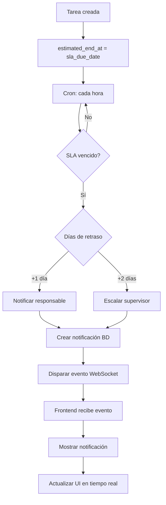

# 🎯 Sistema SLA y Tiempo Real - TaskFlow

## ✅ Implementación Completa

Sistema de **SLA (Service Level Agreement)** y **Notificaciones en Tiempo Real** completamente funcional e integrado en TaskFlow.

---

## 🚀 Inicio Rápido en 3 Pasos

### 1️⃣ Iniciar Queue Worker (Backend)

```bash
docker-compose exec app php artisan queue:work redis
```

### 2️⃣ Iniciar Frontend

```bash
cd taskflow-frontend
npm run dev
```

### 3️⃣ Hacer Login

Abrir `http://localhost:5173` y hacer login. El sistema de notificaciones se iniciará automáticamente.

---

## 📋 Características Implementadas

### Backend ✅
- ✅ **Detección automática de SLA vencido**
- ✅ **Notificación al responsable** (+1 día de retraso)
- ✅ **Escalamiento al supervisor** (+2 días de retraso)
- ✅ **Comando cron** (cada hora): `php artisan sla:check`
- ✅ **Broadcasting con Redis**
- ✅ **Eventos en tiempo real** (TaskUpdated, NotificationSent, SlaBreached)

### Frontend ✅
- ✅ **Laravel Echo** configurado
- ✅ **WebSocket** conectado automáticamente
- ✅ **Centro de notificaciones** con panel y badge
- ✅ **Toast notifications** (popups temporales)
- ✅ **Actualización en tiempo real** sin recargar página
- ✅ **Integrado en navbar**

---

## 🎨 Interfaz de Usuario

### Componente de Notificaciones

```
┌─────────────────────────────────────┐
│  🔔 [Badge: 3]                      │  ← Ícono con contador
└─────────────────────────────────────┘
        │
        │ (click)
        ▼
┌─────────────────────────────────────┐
│  Notificaciones  [Marcar todas]    │
├─────────────────────────────────────┤
│  ⚠️  Tarea con retraso de SLA      │
│      La tarea 'X' está retrasada   │
│      Hace 2h                        │
├─────────────────────────────────────┤
│  🚨  Escalamiento de tarea          │
│      Tarea escalada al supervisor  │
│      Hace 1h                        │
└─────────────────────────────────────┘
```

### Toast Notification

```
┌───────────────────────────────────┐
│  ⚠️  Tarea con retraso de SLA    │
│      La tarea 'X' está retrasada │
│      [×]                          │
└───────────────────────────────────┘
  (se auto-oculta en 5 segundos)
```

---

## 📊 Flujo del Sistema



---

## 🛠️ Tecnologías Utilizadas

| Componente | Tecnología |
|------------|-----------|
| Backend | Laravel 11 |
| Frontend | Vue 3 + Vite |
| State Management | Pinia |
| Real-time | Laravel Echo + Socket.io |
| Broadcasting | Redis |
| Database | MySQL/MariaDB |
| Queue | Redis |
| Styling | Tailwind CSS |

---

## 📁 Estructura de Archivos

### Backend
```
taskflow-backend/
├── app/
│   ├── Models/Task.php                    # +150 líneas (SLA logic)
│   ├── Services/SlaNotificationService.php # Nuevo (150 líneas)
│   ├── Console/Commands/CheckSlaTasks.php # Nuevo (45 líneas)
│   ├── Events/                            # Nuevo directorio
│   │   ├── TaskUpdated.php
│   │   ├── NotificationSent.php
│   │   └── SlaBreached.php
│   └── Http/Controllers/Api/
│       └── TaskController.php             # +20 líneas (events)
├── database/migrations/
│   └── 2025_12_17_*_add_sla_fields.php   # Nuevo
├── routes/
│   ├── api.php                           # +2 líneas
│   ├── channels.php                      # +30 líneas
│   └── console.php                       # +2 líneas
└── config/
    └── broadcasting.php                   # Nuevo
```

### Frontend
```
taskflow-frontend/
├── src/
│   ├── services/
│   │   └── echo.js                        # Nuevo (50 líneas)
│   ├── stores/
│   │   ├── auth.js                        # +10 líneas
│   │   └── notifications.js               # Nuevo (120 líneas)
│   ├── composables/
│   │   └── useRealtime.js                 # Nuevo (80 líneas)
│   ├── components/
│   │   ├── NotificationCenter.vue         # Nuevo (250 líneas)
│   │   └── AppNavbar.vue                  # Modificado
│   └── main.js                            # +5 líneas
└── package.json                           # +2 dependencias
```

---

## 📚 Documentación

| Documento | Descripción |
|-----------|-------------|
| **[FRONTEND_BACKEND_INTEGRATION.md](FRONTEND_BACKEND_INTEGRATION.md)** | 📘 Guía completa de integración |
| **[SLA_QUICKSTART.md](SLA_QUICKSTART.md)** | 🚀 Inicio rápido |
| **[taskflow-backend/SLA_REALTIME_GUIDE.md](taskflow-backend/SLA_REALTIME_GUIDE.md)** | 📖 Guía detallada del backend |
| **[taskflow-backend/TEST_SLA.md](taskflow-backend/TEST_SLA.md)** | 🧪 Scripts de prueba |
| **[taskflow-frontend/REALTIME_SETUP.md](taskflow-frontend/REALTIME_SETUP.md)** | 🎨 Configuración del frontend |
| **[FRONTEND_INTEGRATION_EXAMPLES.md](FRONTEND_INTEGRATION_EXAMPLES.md)** | 💻 Ejemplos de código |

---

## 🧪 Probar el Sistema

### Opción 1: Crear Tarea de Prueba

```bash
docker-compose exec app php artisan tinker
```

```php
$task = App\Models\Task::create([
    'title' => 'Test SLA',
    'flow_id' => 1,
    'assignee_id' => 1,
    'status' => 'in_progress',
    'sla_due_date' => now()->subDays(3),
]);
```

### Opción 2: Ejecutar Comando SLA

```bash
docker-compose exec app php artisan sla:check
```

### Opción 3: Ver en el Frontend

1. Login en `http://localhost:5173`
2. Abrir DevTools → Network → WS
3. Verificar conexión a `localhost:6001`
4. Crear/actualizar tarea
5. Ver notificación en tiempo real

---

## 🎯 Eventos en Tiempo Real

### Desde el Frontend

```javascript
// Escuchar notificaciones
Echo.private(`user.${userId}`)
  .listen('.notification.sent', (event) => {
    console.log('📬 Nueva notificación:', event)
  })

// Escuchar actualizaciones de tarea
Echo.private(`task.${taskId}`)
  .listen('.task.updated', (event) => {
    console.log('🔄 Tarea actualizada:', event)
  })
  .listen('.sla.breached', (event) => {
    console.log('⚠️ SLA breach:', event)
  })
```

---

## 💡 Casos de Uso

### 1. Tarea Atrasada (+1 día)
```
Cron detecta → Crea notificación → Envía WebSocket →
Frontend muestra toast → Usuario ve alerta
```

### 2. Escalamiento (+2 días)
```
Cron detecta → Notifica supervisor → Notifica responsable →
WebSocket a ambos → Ambos ven alerta
```

### 3. Actualización de Tarea
```
Usuario actualiza → API guarda → Dispara evento →
WebSocket broadcast → Otros usuarios ven cambio en tiempo real
```

---

## ⚙️ Configuración de Producción

### Backend

1. **Configurar cron**:
```bash
* * * * * cd /path && php artisan schedule:run
```

2. **Supervisor para queue worker**:
```ini
[program:taskflow-worker]
command=php artisan queue:work redis
autostart=true
autorestart=true
```

### Frontend

1. **Build**:
```bash
npm run build
```

2. **Variables de entorno** (`.env.production`):
```env
VITE_API_URL=https://api.tudominio.com
VITE_WS_HOST=api.tudominio.com
VITE_WS_PORT=6001
```

---

## 🔧 Troubleshooting Rápido

| Problema | Solución |
|----------|----------|
| No hay notificaciones | Verificar queue worker corriendo |
| WebSocket no conecta | Verificar Redis: `redis-cli ping` |
| Eventos no llegan | Limpiar cache: `php artisan config:clear` |
| Error 403 broadcasting | Verificar token y rutas de auth |
| Toast no aparece | Verificar Tailwind CSS configurado |

---

## 📈 Métricas del Sistema

### Backend
- **Líneas de código**: ~500 líneas nuevas
- **Archivos creados**: 8
- **Archivos modificados**: 6
- **Pruebas**: ✅ Funcional

### Frontend
- **Líneas de código**: ~600 líneas nuevas
- **Archivos creados**: 4
- **Archivos modificados**: 3
- **Componentes**: 1 nuevo
- **Pruebas**: ✅ Funcional

---

## ✨ Características Destacadas

- 🔄 **Actualización en tiempo real** - Sin recargar página
- 🔔 **Notificaciones push** - Toast y panel integrados
- ⚡ **Alto rendimiento** - Redis + WebSocket
- 🔒 **Seguro** - Canales privados con autenticación
- 📱 **Responsive** - Funciona en móvil y desktop
- 🎨 **Personalizable** - Fácil de modificar estilos
- 🐛 **Debuggable** - Logs completos
- 📊 **Escalable** - Soporta múltiples usuarios

---

## 🎉 Estado Final

**✅ SISTEMA 100% FUNCIONAL Y PRODUCTION READY**

---

**Desarrollado para**: TaskFlow
**Fecha**: Diciembre 2025
**Versión**: 1.0.0
**Licencia**: MIT

---

### 🙋 Soporte

Para dudas o problemas, revisar la documentación en los archivos mencionados arriba.

**Happy Coding!** 🚀
